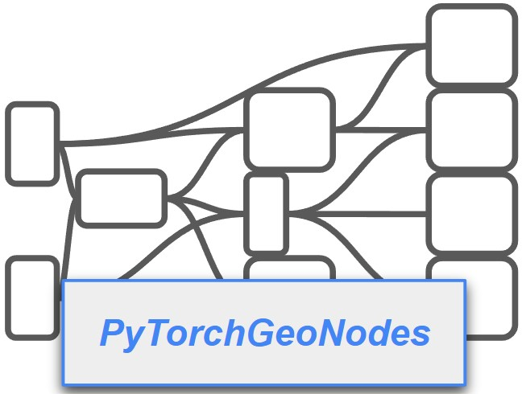

<div align="center">
	

<p align=center> <b> PyTorchGeoNodes is a differentiable module for reconstructing 3D objects from images using interpretable shape programs.
</b></p>

<a href="https://vevenom.github.io/pytorchgeonodes/">Project Page</a> |
<a href="https://arxiv.org/abs/2404.10620">Paper</a>
</div>


Our framework provides different computational nodes that reimplement functionalities of geometry nodes in Blender. More exactly, for node types in Blender, we implement corresponding node types with the same functionalities using PyTorch, or PyTorch3D in case of geometric operations.

### Updates 

- [ ] (Estimate February/March 2025)  Add integration of Gaussian Splatting into PyTorchGeoNodes. (The paper will be updated soon to explain the details)
- [ ] (Estimate February/March 2025)  Add experiments for fitting objects from ScanNet scenes and data preparation scripts
- [x] January 2025 - Add genetic algorithm for fitting shape parameters to target 3D objects. (The paper will be updated soon to explain the details)
- [x] September 2024 - First release that includes a baseline combining coordinate descent and gradient descent for fitting shape parameters to synthetic scenes

### Setup

From the root directory of this repository, create a new conda environment:

```bash
conda env create -f environment.yml
conda activate pytorchgeonodes
```

### Simple gradient descent optimization

The following script demonstrates how to use the PytorchGeoNodes with the Adam optimizer to fit shape parameters of shape program, designed in Blender, to a synthetic scene:

```bash
python demo_optimize_pytorch_geometry_nodes.py --experiment_path demo_outputs/demo_optimize_pytorch_geometry_nodes
```

### Joint discrete and continuous optimization

This script generates a synthetic dataset of scenes with chairs.

```bash
python generate_synthetic_dataset.py --category chair --num_scenes 10 --dataset_path ../Pytorchgeonodes_experiments/synthetic_experiments/synthetic_dataset
```

Preprocess shape parameters:

```bash

python preprocess_dv_values.py --category chair

```

Run the following command to reconstruct shape parameters of the chairs using genetic algorithm. Use ```--skip_refinement``` to run without refinement:

```bash
python reconstruct_synthetic_objects.py --category chair --dataset_name synthetic_dataset --experiment_path synthetic_experiments/ --method genetic --disable_prior --disable_post_tree
```

Alternatively, you can change the method parameter to run reconstruction using coordinate descent baseline:

```bash
python reconstruct_synthetic_objects.py --category chair --dataset_path demo_outputs/demo_dataset --experiment_path demo_outputs/demo_dataset --method cd
```

Run evaluation scripts:

```bash
 python generate_meshes_from_synthetic_reconstructions.py --category chair \
 --experiments_path demo_outputs --experiment_name demo_dataset_cd --solution_name 0best_0_solution.json
 
 python evaluate_params_synthetic.py --category chair  --dataset_path demo_outputs/demo_dataset/ --experiments_path demo_outputs --experiment_name demo_dataset_cd
 
 python evaluate_reconstruction_synthetic.py --category chair  --dataset_path demo_outputs/demo_dataset/ --experiments_path demo_outputs --experiment_name demo_dataset_cd
 ```

## Notes on Designing your Own Shape Programs

1) When designing shape programs with Geometry Nodes feature of Blender, make sure that you use Blender 4.0. Structure of .blend files was changed with newer versions
of Blender and will likely lead to errors when compiling them to PyTorchGeoNodes code.

2) When designing shape programs with Geometry Nodes feature of Blender, check the supported nodes first. Adding support for new nodes should
not be difficult as long as you understand the specific functionalities.

## Contributing

We introduced PyTorchGeoNodes with the goal of creating a framework for developing differentiable shape programs and simplifying their applications in 
tasks in 3D scene understanding. We are encouraging and welcoming contributions and integrations of new functionalities into PyTorchGeoNodes.

## Citation
If you find this code useful, please consider citing our paper:

```
@article{stekovic2024pytorchgeonodes,
  author    = {Stekovic, Sinisa and Ainetter, Stefan and D'Urso, Mattia and Fraundorfer, Friedrich and Lepetit, Vincent},
  title     = {PyTorchGeoNodes: Enabling Differentiable Shape Programs for 3D Shape Reconstruction},
  journal   = {arxiv},
  year      = {2024}
}
```
