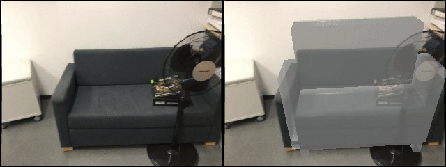
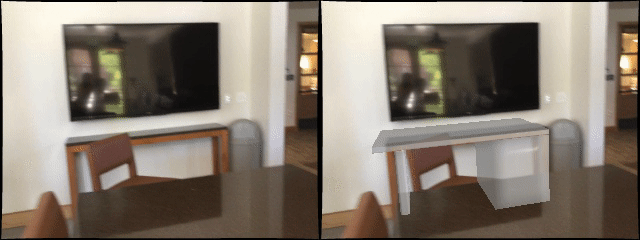
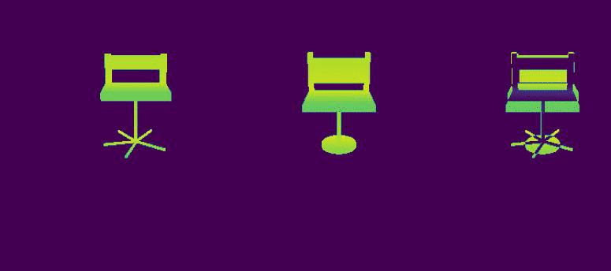
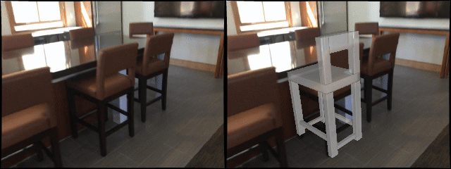
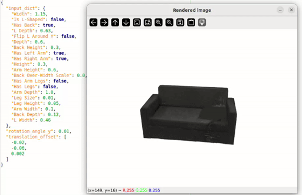

<div align="center">
	

[//]: # ()

<p align=center> <b> PyTorchGeoNodes is a differentiable module for understanding 3D objects using interpretable shape programs.
</b></p>

<a href="https://vevenom.github.io/pytorchgeonodes/">Project Page</a> |
<a href="https://arxiv.org/abs/2404.10620">Paper</a>
</div>


---
## Overview

 

**PyTorchGeoNodes** enables differentiable procedural graphs in PyTorch that reimplement functionalities of Geometry Nodes in Blender. 
More exactly, for different node types of Geometry Nodes, we implement corresponding node types with same 
functionalities using PyTorch, and PyTorch3D in case of geometric operations.

We provide algorithms for fitting parameters of PyTorchGeoNodes programs / procedural models, designed in Blender, to synthetic scenes
and scenes of the ScanNet dataset. In comparison to traditional CAD model retrieval methods, the use of shape programs for 3D reconstruction 
allows for reasoning about the semantic properties of reconstructed objects, editing, low memory footprint, etc.

---
## Updates 

- [x] June 2025 - Add integration of Gaussian Splatting into PyTorchGeoNodes.
- [x] March 2025 - Add experiments for fitting objects from ScanNet scenes and data preparation scripts
- [x] January 2025 - Add genetic algorithm for fitting shape parameters to target 3D objects.
- [x] September 2024 - First release that includes a baseline combining coordinate descent and gradient descent for fitting shape parameters to synthetic scenes

---
### Setup

**Step (1)** From the root directory of this repository, create a new conda environment:

```bash
conda env create -f environment.yml
conda activate pytorchgeonodes
```

---
**Step (2)** Adjust paths config in `configs/general_config.yaml`:
```yaml
experiments_path_base: '<Base-Path-To-Experiments>'
processed_data_path: '<Path-Where-Processed-Decision-Variables-Are-or-Will-Be-Saved>'
```

---
## Experiments

---
### `Synthetic Experiments:`  Simple gradient descent optimization

The following script demonstrates how to use the PytorchGeoNodes with the Adam optimizer to fit shape parameters of shape program, designed in Blender, to a synthetic scene:

```bash
python demo_optimize_pytorch_geometry_nodes.py --experiment_path demo_outputs/demo_optimize_pytorch_geometry_nodes
```

---

---
### `Synthetic Experiments:` Joint discrete and continuous optimization



**Step (1)**  Generate a synthetic dataset of scenes with chairs.

```bash
python generate_synthetic_dataset.py --category chair --num_scenes 10 --dataset_path synthetic_experiments/synthetic_dataset
```

---
**Step (2)** Preprocess shape parameters:

```bash

python preprocess_dv_values.py --category chair

```

---
**Step (3)**  Run the following command to reconstruct shape parameters of the chairs using genetic algorithm. Use ```--skip_refinement``` to run without refinement:

```bash
python reconstruct_synthetic_objects.py --category chair --dataset_name synthetic_dataset --experiment_path synthetic_experiments/ --method genetic
```

**[Note]** Current settings in `config/genetic_settings.yaml` were selected for accurate inference. By modifying parameters, including `population_size`, `num_offsprings`, `num_generations`, you effectively reduce computation time.  


Alternatively, you can change the `--method` to run reconstruction using coordinate descent baseline:

```bash
python reconstruct_synthetic_objects.py --category chair --dataset_name synthetic_dataset --experiment_path synthetic_experiments/ --method genetic --disable_prior --disable_post_tree
```

---
**Step (4)**  Run evaluation script:

```bash
 python evaluate_synthetic_sp_parameters.py --category chair --synthetic_dataset_path synthetic_experiments/synthetic_dataset --experiments_path synthetic_experiments/ --experiment_name synthetic_dataset_genetic --solution_name 0best_0_solution.json 
 ```

---

---
### `ScanNet Experiments:` Joint discrete and continuous optimization



---

**Step (1a)** We provide [two processed demo scenes](https://drive.google.com/file/d/1xzR3a3U7GoJleaTve4oiIJorFk-9W8hF/view?usp=drive_link) 
to get you started. Note that by downloading this file you agree to ScanNet terms of use, and to ScanNet and SCANnotate licenses. 
The folder structure is as follow:

```text
|-- DEMO_PGN_DATA
  |-- scannet_scans # PATH-TO-SCANNET-SCANS, 
  |-- scannotate_dataset # PATH-TO-SCANNOTATE-SCENES
    |-- annotations
    |-- Scannotate_2d_masks # PATH-TO-SCANNOTATE-MASKS-SCENES
    
```


**Step (1b)**  If you want to experiment with more SCANnotate data, you need to preprocess the dataset firs. 
Follow the guide in [README.md](scannotate_preprocessing/README.md) for setting up ScanNet and SCANnotate, and for preprocessing data.


---
**Step (2)**  Adjust paths in `configs/scannotate_config.yaml`:
```yaml
scannet_processed_path: '<PATH-TO-SCANNET-SCANS>'
scannet_ply_path: '<PATH-TO-SCANNET-SCANS>'
scannotate_dataset_path: '<PATH-TO-SCANNOTATE-SCENES>'
scannotate_masks_path: '<PATH-TO-SCANNOTATE-MASKS-SCENES>'
```

---
**Step (3)**  If you have not done so, preprocess shape parameters for `OBJ_CAT` in `[chair, sofa, table]`:

```bash

python preprocess_dv_values.py --category <OBJ_CAT>

```

**Step (4)**  Run the following command to reconstruct shape parameters of the chairs using genetic algorithm, for the selected validation scenes. Use ```--skip_refinement``` to run without refinement:

```bash
python reconstruct_scannotate_objects.py --category OBJ_CAT --experiment_path scannotate_experiments/ --method genetic
```

**[Note]** Current settings in `config/genetic_settings.yaml` were selected for accurate inference. By modifying parameters, including `population_size`, `num_offsprings`, `num_generations`, you effectively reduce computation time.  

---
**Step (5)**  Run evaluation script on all categories

```bash 
python evaluate_scannotate_sp_parameters.py --experiments_path scannotate_experiments/ --experiment_name EXP_NAME --solution_name 0best_0_solution.json 
```

### `ScanNet Experiments:` PyTorchGeoNodes for procedural Gaussian Splatting

**Step (0)** Switch to `procedural_gs` branch and follow the README.md from there:

```bash
git checkout procedural_gs
```

**Step (0)** Note that the implementation of procedural Gaussian Splatting might not be up-to-date with the main branch.

**Step (0)** Install additional modules:

```bash
pip install gsplat==1.4
pip install lpips
pip install pytorch_msssim
pip install tensorboard==2.18
```

**Step (1)** Make sure to setup paths as in previous section.  

**Step (2)** Run the following command for procedural Gaussian splatting with PyTorchGeoNodes:

```bash
python run_pgn_gs_scannotate.py --category OBJ_CAT --annotations_path PATH_TO_SHAPE_PARAMS --scene_name SCENE_NAME --obj_name OBJ_NAME --annotations_file_name ANN_FILE_NAME --experiment_path EXP_PATH
```

**(Example)** Running with g.t. shape parameters on an example demo scene (you can also run with reconstructed parameters):

```bash
python run_pgn_gs_scannotate.py --category sofa --annotations_path sp_gt_annotations/sofa --scene_name scene0025_00 --obj_name obj_2 --annotations_file_name sp_params.json --experiment_path pgn_gs_experiments/
```

or:

```bash
python run_pgn_gs_scannotate.py --category chair --annotations_path sp_gt_annotations/chair --scene_name scene0011_00 --obj_name obj_3 --annotations_file_name sp_params.json --experiment_path pgn_gs_experiments/
```

**Step (4)** Visualize progress with tensorboard:

```bash
tensorboard --logdir PATH_TO_GS_RUN/gaussian_training_logs
```

### Editing procedural Gaussians with PyTorchGeoNodes



**Step (0)** You will need geany (or modify python script to use a different editor) for this demo:

```bash
sudo apt install geany
```

**Step (1)** After running procedural Gaussian splatting, run the demo:

```bash
python demo_modify_gaussians_via_params.py --category OBJ_CAT --annotations_path PATH_TO_SHAPE_PARAMS --scene_name SCENE_NAME --obj_name OBJ_NAME --annotations_file_name ANN_FILE_NAME --experiment_path EXP_PATH
```

For example:
```bash
python demo_modify_gaussians_via_params.py --category sofa --annotations_path sp_gt_annotations/sofa --scene_name scene0025_00 --obj_name obj_2 --annotations_file_name sp_params.json --experiment_path pgn_gs_experiments/
```


---
## Notes on Designing your Own Shape Programs

* When designing shape programs with Geometry Nodes feature of Blender, make sure that you use **Blender 4.0**. Structure of .blend files was changed with newer versions
of Blender and will likely lead to errors when compiling them to PyTorchGeoNodes code.

* When designing shape programs with Geometry Nodes feature of Blender, **check the supported nodes** first. Adding support for new nodes should
not be difficult as long as you understand the specific functionalities.

---
## Contributing

We introduced PyTorchGeoNodes with the goal of creating a framework for developing differentiable shape programs and enabling their applications for 
tasks in 3D scene understanding. We are encouraging and welcoming contributions and integrations of new functionalities into PyTorchGeoNodes.

---
## Citation
If you find this code useful, please consider citing our paper:

```
@article{stekovic2025pytorchgeonodes,
  author    = {Stekovic, Sinisa and Artykov, Arslan and Ainetter, Stefan and D'Urso, Mattia and Fraundorfer, Friedrich},
  title     = {PyTorchGeoNodes: Enabling Differentiable Shape Programs for 3D Shape Reconstruction},
  journal   = {Proceedings of the IEEE/CVF Conference on Computer Vision and Pattern Recognition},
  year      = {2025}
}
```
